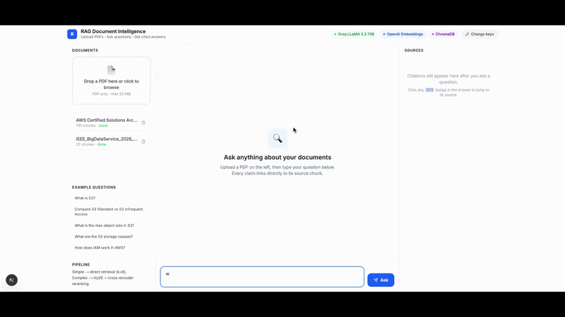

# RAG Document Intelligence Engine

A retrieval-augmented generation (RAG) system with LLM-based query routing, HyDE retrieval,
cross-encoder reranking, and real-time streaming, citation-grounded answers. Built with FastAPI,
Next.js, ChromaDB, OpenAI embeddings, and Groq LLaMA.

**Status:** Functional end-to-end (upload → route → retrieve → generate → cite), verified by
manual testing and a real RAGAS evaluation run. Docker Compose configuration included; AWS
EC2/ECR deployment scripts included for on-demand hosting (not continuously running, to avoid
idle cost).

---

## 🎬 Demo



---

## Overview

The system answers questions about uploaded PDFs with cited sources — every claim in an answer
is tagged `[C1]`, `[C2]`, etc. and linked back to the exact source chunk, document, and page.

**Query routing:** an LLM classifier (Groq LLaMA 3.3 70B) decides whether a question is simple
or complex, and picks a retrieval strategy accordingly:
- **Simple** → direct embedding search against ChromaDB
- **Complex** → HyDE (generate a hypothetical answer, embed *that*, retrieve on it) followed by
  cross-encoder reranking

In testing, simple queries typically resolved in well under a second; complex queries (HyDE +
rerank) typically took one to a few seconds, with the first call after a cold start slower while
the reranker model loads.

---

## Architecture

```
┌─────────────────────────────────────────────────────────────┐
│                        USER QUESTION                         │
└────────────────────────────┬────────────────────────────────┘
                             │
                    ┌────────▼────────┐
                    │  QUERY ROUTER   │ (Groq LLaMA)
                    │ (Simple/Complex)│
                    └────┬────────┬───┘
           ┌────────────┘         └──────────────┐
           │                                      │
    SIMPLE PATH                            COMPLEX PATH
           │                                      │
    ┌──────▼──────┐                    ┌─────────▼────────┐
    │   Embed     │                    │ HyDE Generator   │
    │  Question   │                    │ (Groq LLaMA)     │
    └──────┬──────┘                    └────────┬─────────┘
           │                                    │
    ┌──────▼──────────────┐           ┌────────▼──────────┐
    │ ChromaDB Vector     │           │ Embed Hypothetical │
    │ Search (top-k)      │           │ Answer             │
    │ Cosine Similarity   │           └────────┬───────────┘
    └──────┬──────────────┘                    │
           │                      ┌─────────────▼──────────┐
           │                      │ ChromaDB Vector Search │
           │                      │ (wider top-k)          │
           │                      └─────────────┬──────────┘
           │                                    │
           │                      ┌─────────────▼──────────┐
           │                      │ MS MARCO Cross-Encoder │
           │                      │ Reranker (top 5)       │
           │                      └─────────────┬──────────┘
           │                                    │
           └────────────────┬───────────────────┘
                            │
                  ┌─────────▼──────────┐
                  │  Groq LLaMA 3.3    │
                  │  Generate Answer   │
                  │  with Citations    │
                  └────────┬───────────┘
                           │
                  ┌────────▼────────┐
                  │  Stream Tokens  │
                  │  via SSE        │
                  └────────┬────────┘
                           │
              ┌────────────▼──────────────┐
              │  Browser renders answer   │
              │  with [C1] badges +       │
              │  source panel             │
              └───────────────────────────┘
```

---

## Features

| Feature | Details |
|---|---|
| Query Routing | LLM classifies each question as simple or complex and picks a retrieval strategy |
| HyDE Retrieval | Generates a hypothetical answer and embeds it, improving recall on complex questions |
| Cross-Encoder Reranking | Local MS MARCO MiniLM-L-6-v2 reranker scores (query, chunk) pairs directly |
| Real-Time Streaming | Token-by-token generation via Server-Sent Events |
| Citation System | Every claim tagged `[C1]`/`[C2]`/etc., resolved back to source file, page, and chunk text |
| Per-Request API Keys | Frontend collects OpenAI + Groq keys in `sessionStorage` and sends them as request headers on every call, including document upload/ingestion |
| Vector Persistence | ChromaDB stores embeddings with source/page/chunk metadata, path anchored to the module's own location (consistent regardless of working directory) |
| Docker Ready | Multi-stage builds for backend and frontend |
| RAGAS Evaluated | Faithfulness, answer relevancy, context precision, context recall, measured against a fixed 25-question test set |

---

## Tech Stack

```
Frontend:      Next.js | TypeScript | Tailwind CSS | React
Backend:       FastAPI | Python 3.11 | Pydantic
Vector DB:     ChromaDB (local, persisted)
Embeddings:    OpenAI text-embedding-3-small
LLM:           Groq llama-3.3-70b-versatile
Reranker:      sentence-transformers (cross-encoder/ms-marco-MiniLM-L-6-v2)
Evaluation:    RAGAS (faithfulness, answer relevancy, context precision, context recall)
Deployment:    Docker | Docker Compose | AWS EC2 + ECR (deploy scripts included, on-demand)
```

---

## Quick Start

### Prerequisites
- Python 3.11+
- Node.js 20+
- OpenAI API key (https://platform.openai.com/api-keys)
- Groq API key, free tier (https://console.groq.com/keys) — note the free tier has a
  **100,000 tokens/day** cap, which is enough for normal use and demoing but will rate-limit a
  large evaluation run; see [Evaluation Results](#evaluation-results) below.

### 1. Clone and set up the backend

```bash
git clone https://github.com/ekushal02/Rag-Engine.git
cd Rag-Engine

python -m venv venv
source venv/bin/activate          # Windows: venv\Scripts\activate

pip install -r backend/requirements.txt
```

### 2. Add your API keys

Create a `.env` file at the repo root:

```bash
cat > .env << EOF
OPENAI_API_KEY=sk-proj-YOUR_KEY_HERE
GROQ_API_KEY=gsk_YOUR_KEY_HERE
EOF
```

### 3. Start the backend

Either of these works:

```bash
cd backend && uvicorn api.main:app --reload
```
```bash
python backend/main.py     # run from the repo root
```

Confirm it's up:
```bash
curl http://localhost:8000/health
# {"status":"ok"}
```

Swagger UI: http://localhost:8000/docs

### 4. Start the frontend (new terminal)

```bash
cd frontend
npm install
npm run dev
```

Open http://localhost:3000

### Docker Compose (alternative)

```bash
docker compose up --build
```

---

## API Endpoints

### `POST /upload`
```bash
curl -X POST http://localhost:8000/upload \
  -F "file=@document.pdf" \
  -H "X-OpenAI-Key: sk-proj-..." \
  -H "X-Groq-Key: gsk_..."
```
Response:
```json
{
  "doc_id": "document.pdf",
  "chunk_count": 26,
  "pages": 5,
  "status": "done"
}
```

### `GET /documents`
Lists all ingested documents with chunk counts.

### `POST /query`
Non-streaming question answering; returns the full answer, citations, route taken, latency, and
model used in a single response.

### `GET /query/stream`
Same pipeline, streamed token-by-token via Server-Sent Events, with a final `event: done` payload
containing the full structured response (citations, route, latency, model).

### `DELETE /documents/{doc_id}`
Removes all chunks belonging to a document.

Full interactive docs: http://localhost:8000/docs

---

## Configuration

### Current best-performing configuration

Based on evaluating two configurations against a fixed 25-question test set (see below):

```
chunk_size = 512
chunk_overlap = 32
k (simple path) = 3
complex path retrieves max(3 × k, 15) chunks pre-rerank, reranked down to top 5
```

This was **not** an exhaustive parameter sweep — Groq's free-tier daily token cap (100,000
tokens/day) meant a full grid search across chunk size × overlap × k values couldn't complete in
a single day. What's reported here is a direct comparison between an untuned baseline and one
tuned configuration, both run to completion. A broader sweep is a natural next step if pursued
across multiple days to respect the rate limit.

**This is currently a tested configuration, not a deployed default.** The live API still runs
with `chunk_size=1024` (ingestion default) and `k=5` (query default) unless a caller explicitly
overrides them — the 512/32/3 numbers above only apply when the evaluation scripts call the
underlying functions directly. Aligning the API's defaults with the tested configuration is a
known open item (see [Known Limitations](#known-limitations--honest-gaps)).

### Model choices

| Component | Model | Why |
|---|---|---|
| Embeddings | OpenAI `text-embedding-3-small` | Cheap, good quality, avoids re-embedding cost of switching models later |
| Generation & routing | Groq `llama-3.3-70b-versatile` | Free tier, low latency |
| Reranker | MS MARCO MiniLM-L-6-v2 (local) | Runs on CPU, no API cost, no data leaves the machine |

---

## Evaluation Results

Evaluated with the RAGAS framework against a fixed 25-question test set (`eval_data/test_set.json`),
covering two source documents: an 11-question set on a course syllabus (`sample.pdf`) and a
12-question set on an AI-in-education research paper (`sample2.pdf`), plus 2 no-answer control
questions. A third document (a public-domain NIST publication defining cloud computing) was
ingested alongside these as additional index "noise" but isn't the source of any scored question.

| Metric | Baseline (chunk=512, overlap=64, k=5) | Tuned (chunk=512, overlap=32, k=3)* |
|---|---|---|
| Faithfulness | 0.8133 | 0.9699 |
| Answer Relevancy | 0.3895 | 0.5638 |
| Context Precision | 0.3147 | 0.6864 |
| Context Recall | 0.4800 | 0.8800 |
| **Average** | **0.4994** | **0.7750** |

\* *The tuned configuration was run twice (0.7863 and 0.7637 average) to check for run-to-run
noise, since RAGAS uses an LLM (GPT-4.1-mini) as a judge and judge scoring is not perfectly
deterministic between runs on identical inputs. The table above reports the average of both runs.
The two runs stayed within about 0.02–0.03 of each other on every metric, which is worth knowing
if this number is challenged: it isn't exact to four decimal places, it's a reasonable estimate.*

Tuning chunk size, overlap, and retrieval depth improved the average RAGAS score by roughly
**55%** over the untuned baseline (0.50 → 0.78) on this test set and corpus.

**Important caveat:** this tuned configuration is currently only applied when the evaluation
scripts (`eval/run_eval.py`, `eval/parameter_sweep.py`) call the ingestion/retrieval functions
directly. The live API does **not** default to it — `POST /upload` still chunks at the pipeline's
default `chunk_size=1024` (`backend/ingestion/pipeline.py`), and `POST /query` / `GET /query/stream`
still default to `k=5` (`backend/api/models.py`, `backend/api/routes/query.py`), not `k=3`. If you
upload and query through the running app right now without explicitly overriding these, you're
getting the *un-tuned* defaults, not the config in the table above.

Raw per-question logs and the running summary are in `eval/results/`:
- `eval/results/summary_scores.csv` — appended row per evaluation run
- `eval/results/run_*.csv` — per-question detail for each run

**Reproducing this:**
```bash
python3 eval/run_eval.py           # runs whichever config is set as the default in the script
python3 eval/parameter_sweep.py    # grid search across chunk_size × overlap × k (mind the daily token cap)
```

---

## Security / API Key Handling

- The frontend collects an OpenAI key and a Groq key from the user (`KeySetup.tsx`), stores them
  in `sessionStorage` (cleared on tab close), and sends them as `X-OpenAI-Key` / `X-Groq-Key`
  headers on every request — including document upload/ingestion, not just querying.
- The backend also supports a server-side `.env` with the same two variables. If a request header
  is present, it's used; if not, the server falls back to its own `.env` value. The server
  currently requires these two environment variables to be set in order to start at all — so this
  is a **per-request-key-first design with a local-dev server fallback**, not a deployment with
  zero server-side credentials.
- Uploaded PDFs and their embeddings are stored locally in ChromaDB; nothing is sent to third-party
  analytics or logging services.

---

## Docker & Deployment

### Local
```bash
docker compose up --build
```

### AWS EC2 + ECR
Deployment scripts are included (`deploy/ec2_setup.sh`, `deploy/deploy.sh`,
`docker-compose.prod.yml`) for pushing both images to ECR and running them on an EC2 instance.
This isn't run continuously — it's spun up on demand for a live demo and torn down afterward to
avoid idle EC2/storage costs.

```bash
export EC2_PUBLIC_IP=<your-instance-ip>
./deploy/deploy.sh
```

---

## Known Limitations / Honest Gaps

- The parameter search above compares two configurations, not an exhaustive grid — see
  [Configuration](#configuration).
- RAGAS's LLM-judge scoring has measurable run-to-run variance (~0.02–0.03 per metric on identical
  inputs); treat any single run's numbers as an estimate, not an exact figure.
- The server still requires its own `.env` keys to start (see [Security](#security--api-key-handling));
  it isn't yet a true zero-server-credential deployment.
- Groq's free tier (100,000 tokens/day) is the binding constraint on how much evaluation can be
  run per day — a paid tier would remove this ceiling.
- **The live API's defaults don't match the tested "best" configuration.** `POST /upload` chunks
  at `chunk_size=1024` and querying defaults to `k=5`; the 0.78-average result was measured at
  `chunk_size=512, k=3`, which currently only gets applied via the eval scripts, not through the
  running app. Until the API's defaults are updated to match, the RAGAS numbers above describe a
  configuration you have to opt into explicitly, not what a fresh clone does out of the box.

---

## Project Structure

```
rag-engine/
├── backend/
│   ├── api/               # FastAPI app, routes, models, dependency injection
│   ├── generation/        # Groq-based generation + streaming + citation parsing
│   ├── retrieval/         # Router, direct retriever, HyDE, cross-encoder reranker
│   ├── ingestion/         # PDF extraction, chunking, embedding, ChromaDB storage
│   ├── requirements.txt
│   └── main.py
├── frontend/
│   ├── app/                # chat page, layout
│   ├── components/         # KeySetup, AnswerDisplay, SourcesPanel, DocumentList, UploadZone
│   ├── lib/api.ts           # API client (attaches auth headers)
│   └── types/
├── eval/
│   ├── run_eval.py
│   ├── parameter_sweep.py
│   └── results/
├── eval_data/               # test_set.json + source PDFs
├── scripts/                 # unit/integration test scripts
├── deploy/                  # EC2 setup + deploy scripts
├── docker-compose.yml
├── docker-compose.prod.yml
└── .env.example
```

---

## License

MIT.

---

**Built by Kushal Erramilli | Portfolio project | Last updated July 2026**

